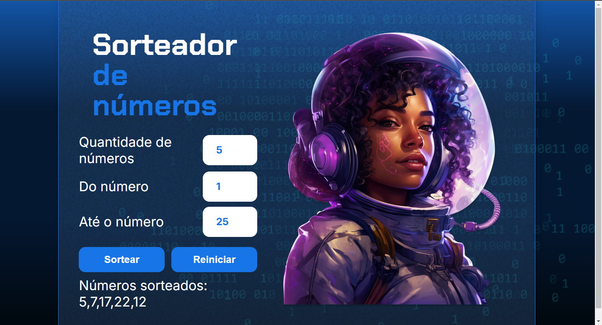

# Sorteador de Números
## Seguindo os aprendizados de Backend em Javascript com a Alura

<h2>TECNOLOGIAS USADAS</h2>
<table style="border-collapse: collapse; margin: 0 auto;">
    <tr>
        <td style="border: none; text-align: center;">
            
        </td>
        <td style="border: none; text-align: center;">
            
        </td>
        <td style="border: none; text-align: center;">
            
        </td>
    </tr>
</table>

### O intuito do projeto foi criar um site onde é possível escolher a quantidade de números e seu intervalo e realizar um sorteio completamente aleatório muito semelhantes as funções do site https://sorteador.com.br/ com tratativa de erro ao criar incoêrencias no sorteio (como a quantidade de números ser maior do que o intervalo dos números do sorteio), porém bem mais básico e menos estilizado.

## Print da tela com o site funcional

